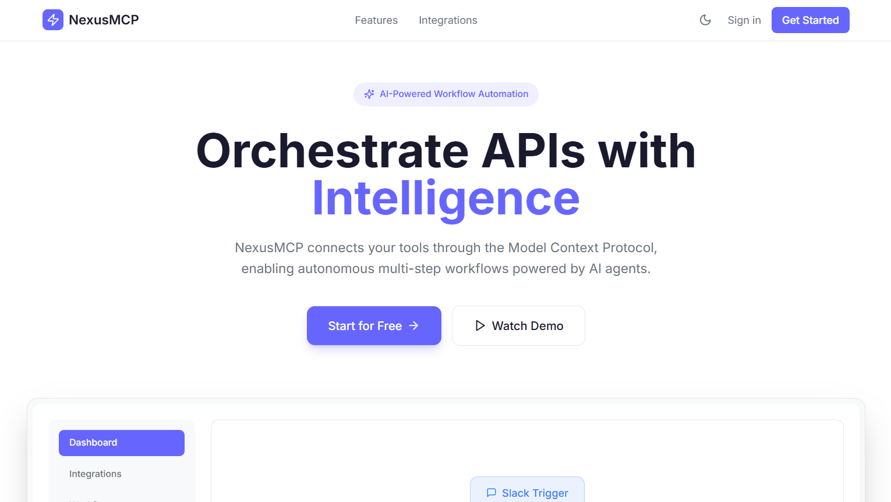

<div align="center">

# NexusMCP

**Agentic MCP Orchestration Platform**

_Transform natural language into reliable multi-service workflows_

[](https://nodejs.org/)
[](https://python.org/)
[](https://typescriptlang.org/)
[](LICENSE)

[Overview](#overview) | [Installation](#installation) | [Workflow](#workflow-lifecycle) | [Agents](#agent-system) | [Connectors](#connectors) | [Configuration](#system-configuration)

</div>

---

## Overview

NexusMCP is a full-stack workflow automation platform that converts natural language prompts into executable multi-service flows. It combines a Next.js UI, an Express API, and Python-based agent/connectors services to plan, validate, and orchestrate tool calls across Jira, GitHub, Slack, Google Sheets, and Gmail.

### Core capabilities

- Natural language to executable plan generation.
- Connector-aware planning with blocked/ready states.
- Service-level validation before execution.
- Structured flow output for visual DAG rendering.
- Smart execution mode for dynamic tool sequencing.

---

## Demo and Screenshots

### Demo video

Add your demo video URL here:

- `https://drive.google.com/file/d/10ap6nK_95kkLovBvEbgrCEw2coZygrps/view?usp=drive_link`

### Screenshots

The following screenshot paths were added exactly as provided:

- `@\apps\public\1.png`
- `C:\Users\Sudhir\OneDrive\Pictures\Screenshots\Screenshot 2026-04-11 115548.png`
- `C:\Users\Sudhir\OneDrive\Pictures\Screenshots\Screenshot 2026-04-11 115833.png`

Preview links (local file URIs):




> Note: absolute local paths work for local viewing, but not on GitHub for other users. For shared docs, move images into the repo (for example `docs/images/`) and reference relative paths.

---

## Architecture

```text
Next.js Client (5000)
        |
Express API (3000)
        |
        +--> Agentic Service (8010) - prompt analysis and flow planning
        |
        +--> MCP Connector Gateway (8001) - tool invocation
        |
        +--> Data and auth layers (MongoDB, PostgreSQL, Redis)
```

### Monorepo structure

```text
NexusMCP/
|- apps/
|  |- api/                 # Express + TypeScript backend
|  |- client/              # Next.js dashboard
|- packages/               # Shared TS packages
|- services/
|  |- agentic/             # Gemini-backed planning/orchestration service
|  |- mcp-connectors/      # FastAPI connector gateway
|  |- workflow-engine/     # LLM planner + DAG utilities
|  |- agent-runtime/       # Runtime execution primitives
|  |- context-manager/     # Context and payload utilities
|- infra/                  # Docker and DB setup
```

---

## Installation

### Prerequisites

- Node.js `18+`
- npm `10+`
- Python `3.11+`
- MongoDB instance (local or Atlas)

### 1) Clone and install dependencies

```bash
git clone https://github.com/your-org/nexusmcp.git
cd nexusmcp
npm install
```

### 2) Configure environment files

```bash
cp apps/api/.env.example apps/api/.env
cp apps/client/.env.example apps/client/.env
cp services/agentic/.env.example services/agentic/.env
```

Set required values:

- `apps/api/.env`
  - `MONGODB_URI`
  - `JWT_SECRET`
  - `GOOGLE_CLIENT_ID`
  - `GOOGLE_CLIENT_SECRET`
  - `AGENTIC_SERVICE_URL=http://localhost:8010`
  - `JIRA_GATEWAY_ENDPOINT=http://localhost:8001/invoke`
- `apps/client/.env`
  - `NEXT_PUBLIC_API_URL=http://localhost:3000/api`
- `services/agentic/.env`
  - `GEMINI_API_KEY`
  - optional: `GEMINI_MODEL`, `REQUEST_TIMEOUT_SECONDS`

### 3) Prepare Python services environment (recommended on Windows)

```bash
npm run setup:py-services
```

This script creates `.venv` in the repo root, installs `services/requirements-all.txt`, and checks required env values.

### 4) Start services

Terminal 1 (client + API with Turbo):

```bash
npm run dev
```

Terminal 2 (Agentic planner service):

```bash
npm run dev:agentic
```

Terminal 3 (MCP connectors service):

```bash
cd services/mcp-connectors
python -m uvicorn src.server:app --reload --port 8001
```

### 5) Verify local URLs

- Client: `http://localhost:5000`
- API: `http://localhost:3000`
- API health: `http://localhost:3000/health`
- Agentic health: `http://localhost:8010/health`
- Connectors health: `http://localhost:8001/health`

---

## Workflow Lifecycle

NexusMCP supports three agentic planning modes exposed through API routes:

- `POST /api/workflows/agentic-flow` -> streamlined planning flow.
- `POST /api/workflows/default-flow` -> fixed 5-step default orchestration.
- `POST /api/workflows/smart-execute` -> dynamic LLM-generated execution plan.

### Default 5-step flow

1. Prompt ingest.
2. Context analysis.
3. Required connector/API check.
4. Execution flow generation.
5. Final response assembly.

If required services are missing/disconnected, the flow returns a blocked response with required actions instead of proceeding blindly.

---

## Agent System

The `services/agentic` service composes specialized agents for planning and orchestration:

- `ContextAnalysisAgent` - extracts intent, summary, risk, and target services.
- `RequiredAPIAgent` - identifies required integrations and readiness.
- `PlannerAgent` - drafts service-level plan structure.
- `ToolSelectionAgent` - filters/selects tools from available tool catalog.
- `ToolPlannerAgent` - creates executable tool-step plan.
- `JsonGuardAgent` - validates/sanitizes generated plan payloads.
- `ConnectorAgent` - maps plan steps to connector execution units.
- `OrchestratorAgent` - builds final graph/flow response payload.
- Specialized service agents - `JiraAgent`, `GitHubAgent`, `SlackAgent`, `GoogleSheetsAgent`, `GmailAgent`.
- Additional orchestrators - `DefaultFlowOrchestrator`, `SmartOrchestrator`.

---

## Connectors

`services/mcp-connectors` exposes a FastAPI gateway with registered connectors:

- Jira connector
- GitHub connector
- Slack connector
- Google Sheets connector

### Connector endpoints

- `GET /health`
- `GET /tools`
- `GET /connectors`
- `POST /invoke`

`POST /invoke` accepts a normalized tool request and dispatches it to the owning connector.

---

## System Configuration

### Ports

| Component                              | Port | Purpose                                |
| -------------------------------------- | ---- | -------------------------------------- |
| Client (`apps/client`)                 | 5000 | Next.js UI                             |
| API (`apps/api`)                       | 3000 | REST API + auth + orchestration routes |
| Agentic (`services/agentic`)           | 8010 | Gemini-backed planner/orchestrator     |
| Connectors (`services/mcp-connectors`) | 8001 | External tool invocation gateway       |

### Key API environment variables (`apps/api/.env`)

- `PORT`, `NODE_ENV`, `CLIENT_URL`
- `MONGODB_URI`
- `JWT_SECRET`, `JWT_EXPIRES_IN`
- `GOOGLE_CLIENT_ID`, `GOOGLE_CLIENT_SECRET`, `GOOGLE_CALLBACK_URL`
- `JIRA_GATEWAY_ENDPOINT`
- `AGENTIC_SERVICE_URL`, `AGENTIC_SERVICE_TIMEOUT_MS`

### Connector/integration env variables

- Jira: `JIRA_BASE_URL`, `JIRA_EMAIL`, `JIRA_API_TOKEN`
- Slack: `SLACK_BOT_TOKEN`
- GitHub: `GITHUB_TOKEN`
- Google Sheets: `GOOGLE_SERVICE_ACCOUNT_JSON`, `GOOGLE_SHEETS_SPREADSHEET_ID`
- Gmail OAuth tokens are user-driven through Google auth flows.

---

## API Surface (High-Level)

### Auth

- `POST /api/auth/register`
- `POST /api/auth/login`
- `GET /api/auth/me`
- `POST /api/auth/logout`
- `GET /auth/google`
- `GET /auth/google/gmail`

### Workflows

- `GET /api/workflows`
- `POST /api/workflows`
- `PUT /api/workflows/:id`
- `DELETE /api/workflows/:id`
- `POST /api/workflows/generate`
- `POST /api/workflows/agentic-flow`
- `POST /api/workflows/default-flow`
- `POST /api/workflows/smart-execute`

### Integrations

- `GET /api/integrations`
- `POST /api/integrations/:id/connect`
- `POST /api/integrations/:id/disconnect`
- `POST /api/integrations/:id/test`
- `GET /api/integrations/:id/capabilities`

---

## Build and Development Commands

```bash
# Monorepo
npm run dev
npm run build
npm run lint
npm run test

# Python service helpers
npm run setup:py-services
npm run dev:agentic

# Docker
npm run docker:up
npm run docker:logs
npm run docker:down
```

---

## Troubleshooting

- `redirect_uri_mismatch`: verify `GOOGLE_CALLBACK_URL` in `apps/api/.env` and Google console.
- CORS issues: confirm `CLIENT_URL` matches your UI origin.
- Agentic timeout: increase `AGENTIC_SERVICE_TIMEOUT_MS`.
- Integration test failures: verify provider tokens and scopes.
- Port conflicts: free the port or change env/config values.

---

## License

MIT License. See `LICENSE`.
